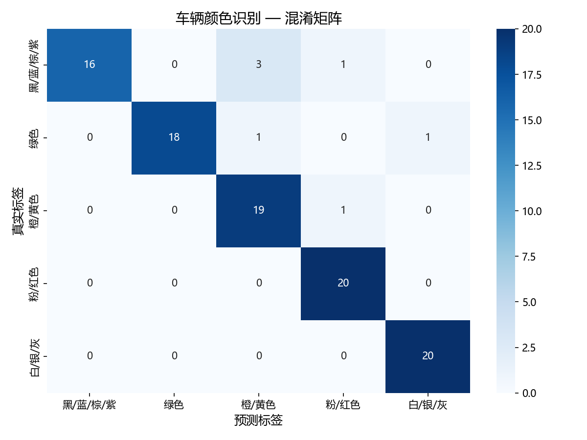
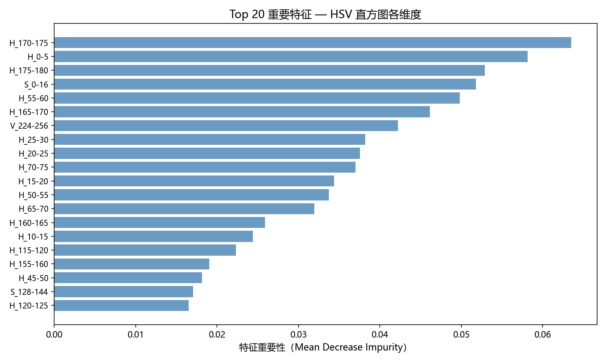

# 🚗 车辆颜色识别系统 (Vehicle Color Recognition)

> 面向高速公路卡口监控场景的车辆颜色识别算法，针对低算力边缘侧设备优化，无需 GPU 即可完成多类车色的实时分类。

[](https://www.python.org/)
[](https://opencv.org/)
[](https://scikit-learn.org/)
[](LICENSE)

---

## 📌 项目背景

本项目负责车辆颜色识别（VCR）算法的开发与边缘侧部署优化。

高速监控场景面临以下核心挑战：

- 🌦️ **光照剧烈变化**：夜间路灯、正午强光、隧道出入口明暗交替
- 🚀 **运动模糊**：高速通行车辆导致图像模糊，纹理细节丢失
- 🌑 **车身反光与阴影**：金属车漆强反光、路牌/树木投影覆盖车身
- ⚡ **边缘侧算力限制**：前端感知模组无 GPU，要求纯 CPU 实时推理

---

## 🎯 实验结果

| 模型 | 准确率 | 推理时延(ms/样本) | 边缘部署 |
|------|--------|-----------------|---------|
| KNN (K=5) | 94.00% | 2.07 | ❌ 内存占用高 |
| SVM (RBF) | 95.00% | 0.08 | ⚠️ 核函数计算依赖矩阵运算 |
| **随机森林（最终方案）** | **93.00%** | **0.48** | **✅ If-Else 决策，CPU 友好** |

> SVM 准确率略高，但其 RBF 核函数在边缘侧 CPU 上的批量推理开销更大；随机森林的 If-Else 决策路径天然适合无 GPU 环境，综合权衡后选择随机森林作为最终部署方案。

**各类别详细指标（随机森林，测试集 100 张）：**

| 颜色类别 | Precision | Recall | F1-Score |
|---------|-----------|--------|----------|
| 黑/蓝/棕/紫 | 1.00 | 0.80 | 0.89 |
| 绿色 | 1.00 | 0.90 | 0.95 |
| 橙/黄色 | 0.83 | 0.95 | 0.88 |
| 粉/红色 | 0.91 | 1.00 | 0.95 |
| **白/银/灰** | **0.95** | **1.00** | **0.98** |
| **加权平均** | **0.94** | **0.93** | **0.93** |

---

## 🧠 算法设计

### 核心问题：为什么不用 RGB，改用 HSV？

RGB 三通道耦合了亮度信息。同一辆蓝色轿车在强光下和阴影下的 RGB 数值差异极大，导致基于 RGB 的特征严重漂移。

HSV 将颜色解耦为三个独立维度：

```
H（Hue/色调）     → 颜色的本质，如红/蓝/绿，不受光照强度影响
S（Saturation）  → 颜色的纯度
V（Value/亮度）   → 像素明暗，与色调解耦
```

通过重点建模 H 和 S 通道，大幅抑制路灯强光、车身反光引起的特征漂移。

---

### Step 1：图像预处理流水线

```
原始图像
  ↓ resize(256×256)
  ↓ CLAHE（对比度受限自适应直方图均衡化）→ 解决弱光/过曝
  ↓ 双边滤波（Bilateral Filter）        → 去噪，同时保留车身边缘
  ↓ ROI 裁剪（去掉天空背景和路面）
  ↓ resize(128×128)
预处理完成
```

**CLAHE vs 普通直方图均衡化：**
普通均衡化是全局操作，容易过度拉伸导致噪声放大。CLAHE 将图像划分为小块分别均衡化，通过 `clipLimit` 参数限制对比度放大上限，兼顾局部增强与噪声抑制。

**双边滤波 vs 高斯滤波：**
高斯滤波只考虑空间距离，会模糊边缘。双边滤波同时考虑空间距离和像素值差异，在平滑车漆表面噪点的同时，保留车身轮廓边缘不被模糊。

---

### Step 2：HSV 非均匀量化直方图特征提取

```python
# 非均匀量化策略（共 60 维特征）
H 通道：36 bins  → 细分，捕捉颜色差异（色调是核心信息）
S 通道：16 bins  → 中等粒度
V 通道：8  bins  → 粗分（亮度是辅助信息，不需要太精细）
```

各通道直方图独立 L1 归一化后拼接，使不同分辨率的图像可以直接比较。

---

### Step 3：数据增强（解决光照分布偏差）

针对高速卡口图像光照复杂的问题，训练阶段对每张图使用 Gamma 校正生成两个增强版本：

```python
gamma = 0.5  → 图像变暗，模拟夜间/逆光场景
gamma = 1.8  → 图像变亮，模拟强光/过曝场景
```

训练集从 400 张扩充至 1200 条样本。

**重要：先划分数据集，再做增强**，避免同一张原图的增强版本同时出现在训练集和测试集中导致评估结果虚高（Data Leakage）。

---

### Step 4：代价敏感学习（处理类别不平衡）

粉色、紫色等稀有颜色样本量远少于白色、黑色。使用 `class_weight='balanced'` 让分类器自动根据各类样本数反比计算权重，对稀有类别赋予更高误分代价，提升长尾颜色的召回率。

---

## 📊 可视化结果

### 混淆矩阵


### Top 20 特征重要性


---

## 🗂️ 项目结构

```
vcr_project/
├── data/
│   ├── raw/                        # 训练数据（按颜色分类）
│   │   ├── black_blue_brown_purple/
│   │   ├── green/
│   │   ├── orange_yellow/
│   │   ├── pink_red/
│   │   └── white_silver_gray/
│   └── test/                       # 测试图片
│       ├── black1.JPG
│       ├── blue1.JPG
│       ├── red1.JPG
│       └── white1.JPG
├── src/
│   ├── preprocess.py               # 预处理模块（CLAHE + 双边滤波）
│   ├── feature_extraction.py       # HSV 特征提取
│   ├── train.py                    # 训练 + 模型对比 + 评估报告
│   ├── predict.py                  # 单图推理接口
│   └── utils.py                    # 工具函数
├── models/                         # 训练好的模型（.pkl）
├── results/                        # 混淆矩阵、特征重要性图、分类报告
├── notebooks/
│   └── exploration.ipynb           # 数据探索与实验记录
├── tests/
│   └── test_pipeline.py            # 单元测试
├── requirements.txt
└── README.md
```

---

## 🚀 快速开始

### 环境要求

- Python **3.8 或以上**（推荐 3.8 ~ 3.11）
- 操作系统：Windows / macOS / Linux 均可
- 无需 GPU，普通 CPU 即可运行

---

### 第一步：克隆项目到本地

打开终端（Windows 用 PowerShell 或 CMD，macOS/Linux 用 Terminal），执行：

```bash
git clone https://github.com/YangZ0225/vehicle-color-recognition.git
cd vehicle-color-recognition
```

> 如果没有安装 Git，可以直接在 GitHub 页面点击绿色的 **Code → Download ZIP**，解压后进入项目文件夹。

---

### 第二步：创建虚拟环境（推荐）

使用虚拟环境可以避免依赖冲突，强烈建议操作：

```bash
# 创建虚拟环境
python -m venv venv

# 激活虚拟环境
# macOS / Linux：
source venv/bin/activate

# Windows CMD：
venv\Scripts\activate.bat

# Windows PowerShell：
venv\Scripts\Activate.ps1
```

激活成功后，终端前会出现 `(venv)` 前缀。

---

### 第三步：安装依赖

```bash
pip install -r requirements.txt
```

> 🇨🇳 **国内网络**安装较慢时，使用清华镜像源加速：
> ```bash
> pip install -r requirements.txt -i https://pypi.tuna.tsinghua.edu.cn/simple
> ```

安装完成后，可验证关键依赖是否正常：

```bash
python -c "import cv2, sklearn, numpy; print('环境检查通过 ✅')"
```

---

### 第四步：准备训练数据

将车辆图片按颜色类别分类，放入以下对应文件夹：

```
data/raw/black_blue_brown_purple/   ← 黑色、蓝色、棕色、紫色
data/raw/green/                     ← 绿色
data/raw/orange_yellow/             ← 橙色、黄色
data/raw/pink_red/                  ← 粉色、红色
data/raw/white_silver_gray/         ← 白色、银色、灰色
```

**说明：**
- 每类建议至少放 **50 张以上**图片，以保证模型质量
- 支持 `.jpg`、`.jpeg`、`.png`、`.JPG` 等常见格式
- 若只想直接测试推理，可跳过此步，使用项目自带的预训练模型（`models/` 目录下）

---

### 第五步：训练模型

```bash
python src/train.py
```

训练过程会依次完成：数据加载 → 预处理 → 特征提取 → 数据增强 → 模型训练（KNN / SVM / 随机森林对比）→ 评估报告输出。

训练完成后，以下文件会自动生成：

```
models/random_forest_model.pkl     # 训练好的随机森林模型
results/confusion_matrix.png       # 混淆矩阵图
results/feature_importance.png     # 特征重要性图
results/classification_report.txt  # 分类报告
```

> ⏱️ 在普通笔记本上，1200 条样本的训练通常在 **1 分钟内**完成。

---

### 第六步：推理测试（识别单张图片颜色）

使用训练好的模型对图片进行颜色识别：

```bash
python src/predict.py --image data/test/red1.jpg
```

将 `data/test/red1.jpg` 替换为你自己的图片路径即可。

**示例输出：**

```
识别结果：
  颜色类别: 粉/红色
  置信度:   78.55%
  推理耗时: 192.29 ms
```

---

### 第七步：运行单元测试

验证整个流水线是否正常工作：

```bash
python tests/test_pipeline.py
```

所有测试通过后，说明环境配置完全正确。

---

### ❓ 常见问题

**Q：运行时提示 `ModuleNotFoundError`？**
确认虚拟环境已激活（终端前有 `(venv)`），然后重新执行 `pip install -r requirements.txt`。

**Q：`python` 命令找不到？**
部分系统需要使用 `python3` 代替 `python`，例如：`python3 src/train.py`。

**Q：图片路径报错？**
确保路径中没有中文或空格，建议使用英文路径。Windows 用户注意使用 `/` 或 `\\` 作为路径分隔符。

---

## 🔍 置信度说明

测试图片为高速公路实拍图像（暗光、逆光、运动模糊），与训练集图像风格存在一定差异，因此部分样本置信度偏低属于正常现象。提升方向是补充同风格训练数据。

| 测试图片 | 识别结果 | 置信度 |
|---------|---------|--------|
| black1.JPG | 黑/蓝/棕/紫 ✅ | 85.03% |
| red1.JPG | 粉/红色 ✅ | 78.55% |
| blue1.JPG | 黑/蓝/棕/紫 ✅ | 56.77% |
| white1.JPG | 白/银/灰 ✅ | 48.92% |

> 4 张测试图全部识别正确，置信度差异来源于图像质量和光照条件的不同。

---

## 📦 依赖版本

```
opencv-python>=4.5.0
numpy>=1.21.0
scikit-learn>=1.0.0
matplotlib>=3.4.0
seaborn>=0.11.0
joblib>=1.0.0
Pillow>=8.0.0
tqdm>=4.60.0
```

---

## 📄 License

MIT License — 仅供学习交流使用
